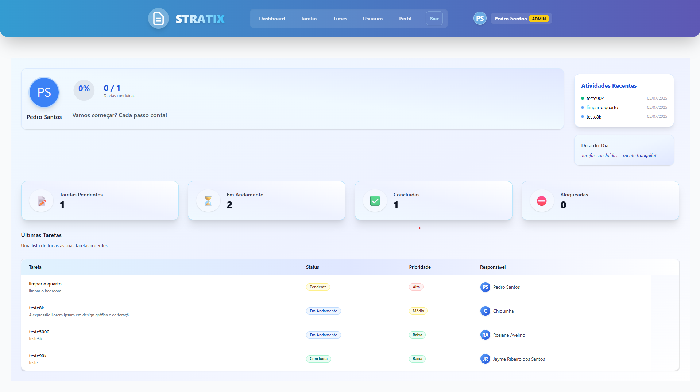

# ✅ STRATIX - Task Manager Frontend

🖥️ A modern, responsive web application for managing tasks, built with React, TypeScript, Vite, and Tailwind CSS. Create, update, organize, and track your tasks with an intuitive and beautiful interface!

## 📋 Table of Contents
- [✨ Features](#features)
- [🛠️ Technologies Used](#technologies-used)
- [🏗️ Project Structure](#project-structure)
- [🚀 Getting Started](#getting-started)
- [🖼️ Screenshots](#screenshots)
- [🤝 Contributing](#contributing)

## ✨ Features

- 📝 **Full Task Management**
  - Create, edit, delete, and mark tasks as completed with a single click.
  - Bulk actions: select and manage multiple tasks at once.
- 📅 **Organization & Productivity**
  - Organize tasks by status (To Do, In Progress, Done), priority, category, or due date.
  - Visual calendar and deadline reminders to never miss important tasks.
  - Drag-and-drop task reordering for custom workflows.
- 🔎 **Smart Search & Filters**
  - Real-time search by title, description, tag, or status.
  - Advanced filters for priorities, overdue, upcoming, and completed tasks.
- 📊 **Dashboard & Analytics**
  - Responsive dashboard with charts: see productivity, completed tasks, and trends.
  - Task completion streaks and statistics to motivate users.
- 🔔 **Notifications & UX**
  - Toast notifications for actions and reminders.
  - Smooth animations and transitions for a delightful experience.
- 🌐 **API Integration**
  - Real-time sync with the backend API for persistent data and multi-device access.
- 📱 **Mobile Friendly**
  - 100% responsive: works perfectly on desktop, tablet, and mobile devices.

## 🛠️ Technologies Used

-  **React 18** — Component-based UI for fast, interactive experiences.
-  **TypeScript** — Type safety and modern JS features for reliability.
-  **Vite** — Lightning-fast development and builds.
-  **Tailwind CSS** — Utility-first, customizable styling for a beautiful UI.
-  **React Query** — Powerful data fetching, caching, and real-time sync with the API.
-  **Zustand** — Simple, scalable global state management.
-  **React Hook Form** — High-performance forms with validation.
-  **Axios** — HTTP client for API integration.
-  **Heroicons & Lucide** — Iconography for a friendly, modern look.
-  **Jest** — Unit and integration testing for robust code.

## 🏗️ Project Structure
```
frontend/
├── public/                 # Static assets
├── src/
│   ├── assets/             # Images and icons
│   ├── components/         # UI Components (TaskForm, TaskList, etc.)
│   ├── hooks/              # Custom React hooks
│   ├── pages/              # Application pages
│   ├── routes/             # App routes
│   ├── store/              # Zustand state management
│   ├── styles/             # Tailwind and custom styles
│   ├── App.tsx             # Main app component
│   └── ...
├── package.json            # Project metadata and dependencies
├── index.html              # App entry point
└── ...
```

## 🚀 Getting Started

1. **Clone the repository**
   ```bash
   git clone https://github.com/pedroavv1914/api-gerenciador-de-tarefas.git
   cd api-gerenciador-de-tarefas/frontend
   ```
2. **Install dependencies**
   ```bash
   npm install
   ```
3. **Run the development server**
   ```bash
   npm run dev
   ```
4. **Open in your browser**
   ```
   http://localhost:5173
   ```

## 🖼️ Screenshots



## 🤝 Contributing

Pull requests are welcome! For major changes, please open an issue first to discuss what you would like to change.

---

Made with ❤️ by Pedro
